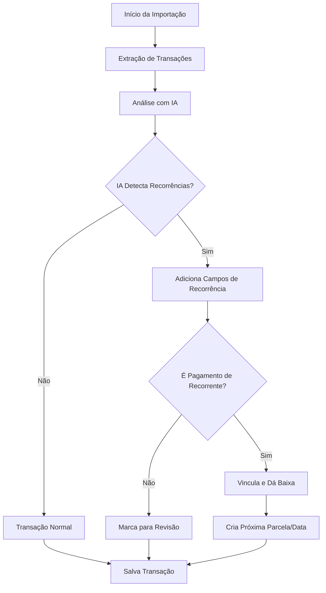

# Implementação de Detecção de Recorrências na Importação

## Resumo

Foi implementada a **Fase 1** do sistema de detecção automática de recorrências durante a importação de extratos bancários com IA.

## Alterações Realizadas

### 1. Prompt de IA Aprimorado
**Arquivo:** `app/Services/AIConfigService.php`
- Adicionada seção completa de detecção de transações recorrentes e parceladas
- Instruções específicas para identificar:
  - Serviços de streaming (Netflix, Spotify, etc.)
  - Contas de consumo (água, luz, gás, internet)
  - Assinaturas e mensalidades
  - Parcelamentos (PARC XX/YY)
- Vinculação automática com transações recorrentes existentes

### 2. Novos Campos no Retorno da IA
- `is_recurring`: indica se é uma nova transação recorrente detectada
- `is_recurring_payment`: indica se é pagamento de recorrente existente
- `related_recurring_id`: ID da transação recorrente vinculada
- `recurrence_type`: tipo de recorrência ('none', 'fixed', 'installment')
- `installment_number`: número da parcela atual
- `total_installments`: total de parcelas
- `recurring_pattern`: padrão detectado (ex: "Netflix - Mensalidade")

### 3. Processamento de Recorrências
**Arquivo:** `app/Http/Controllers/TempStatementImportController.php`

#### Método `extractGeminiJsonOutput`
- Atualizado para processar todos os novos campos de recorrência

#### Método `applyCategorizationToTransactions`
- Adiciona os campos de recorrência detectados pela IA às transações

#### Novo Método `processRecurringLinks`
- Processa vínculos com transações recorrentes existentes
- Dá baixa automática em faturas vinculadas
- Cria próximas parcelas quando aplicável
- Atualiza próximas datas para recorrências fixas

#### Novo Método `createNextInstallment`
- Cria automaticamente a próxima parcela de transações parceladas

### 4. Integração no Fluxo de Importação
- Após salvar as transações, o sistema processa automaticamente os vínculos de recorrência
- Mensagem de feedback atualizada para informar quantas recorrências foram processadas

## Fluxo de Funcionamento

## Benefícios Implementados

1. **Detecção Automática**: IA identifica padrões de recorrência automaticamente
2. **Vinculação Inteligente**: Transações importadas são vinculadas com recorrentes pendentes
3. **Baixa Automática**: Faturas recorrentes são baixadas sem intervenção manual
4. **Gestão de Parcelas**: Próximas parcelas são criadas automaticamente
5. **Economia de Tempo**: Reduz drasticamente o trabalho manual de categorização

## Próximas Fases

### Fase 2 - Interface de Revisão
- Criar tela para revisar recorrências detectadas
- Permitir criar novas recorrências a partir das detecções
- Opção de ignorar sugestões

### Fase 3 - Dashboard e Relatórios
- Visualização de recorrências ativas
- Relatórios de economia de tempo
- Métricas de acurácia da IA

## Testes Realizados

- Comando `test:recurring-detection` validou o prompt e campos
- Verificação de todos os campos necessários no prompt
- Exemplos de resposta esperada validados

## Commits

- `9d5b6b8`: feat: Implementa detecção de recorrências na importação com IA 